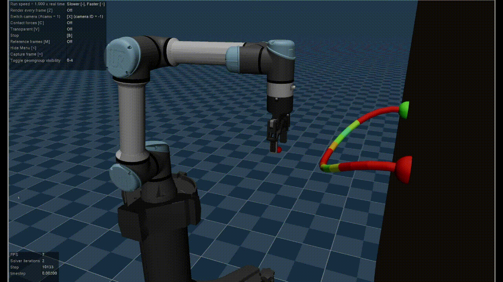

# homestri-ur5e-rl

Welcome to the **homestri-ur5e-rl** repository! This repository provides a Mujoco Gymnasium Environment designed for manipulating flexible objects using a UR5e robot arm and a Robotiq 2F-85 gripper.



## Overview

The key features of this repository are:

- **Mujoco Simulation**: The repository contains an example Mujoco XML configuration featuring a UR5e robot arm with an attached Robotiq 2F-85 gripper. This setup allows the robot to interact with a flexible cable in a simulated environment.

- **Gymnasium Integration**: The environment is seamlessly integrated into the Gymnasium framework and comes with a graphical user interface (GUI) that visualizes the Mujoco simulation. This GUI provides an interactive way to observe the robot's actions and interactions.

- **Controller Variety**: The UR5e robot arm offers multiple controller options, enabling various modes of control, including:
  - Joint effort controller
  - Joint velocity controller
  - Joint position controller
  - Operational space controller
  
- **Teleoperation**: For manual control, keyboard input is supported, allowing teleoperation of the robot in task space. This can be particularly useful for specific tasks that require direct human intervention.

## Repository Information

Please note the following details about this repository:

- **Maintenance and Status**: This repository is not actively maintained and should be considered experimental. It was created during the initial stages of learning Mujoco.

- **References**: The development of this repository drew inspiration from the following repositories:
  - [ARISE-Initiative/robosuite.git](https://github.com/ARISE-Initiative/robosuite.git)
  - [ir-lab/irl_control.git](https://github.com/ir-lab/irl_control.git)
  - [abr/abr_control.git](https://github.com/abr/abr_control.git)

## Installation

Follow these steps to set up the environment:

1. Clone the repository:
   ```
   git clone https://github.com/ian-chuang/homestri-ur5e-rl.git
   ```

2. Navigate to the repository directory:
   ```
   cd homestri-ur5e-rl
   ```

3. Install the required packages using pip:
   ```
   pip install -e .
   ```

## Testing the Environment

To test the environment, you can execute the following command:
```
python scripts/test_base_robot_env.py
```

Feel free to explore and experiment with the capabilities of the **homestri-ur5e-rl** environment. Keep in mind that this repository is an experimental project and might not receive regular updates. If you encounter issues or have questions, refer to the repository or seek support from the developer community.